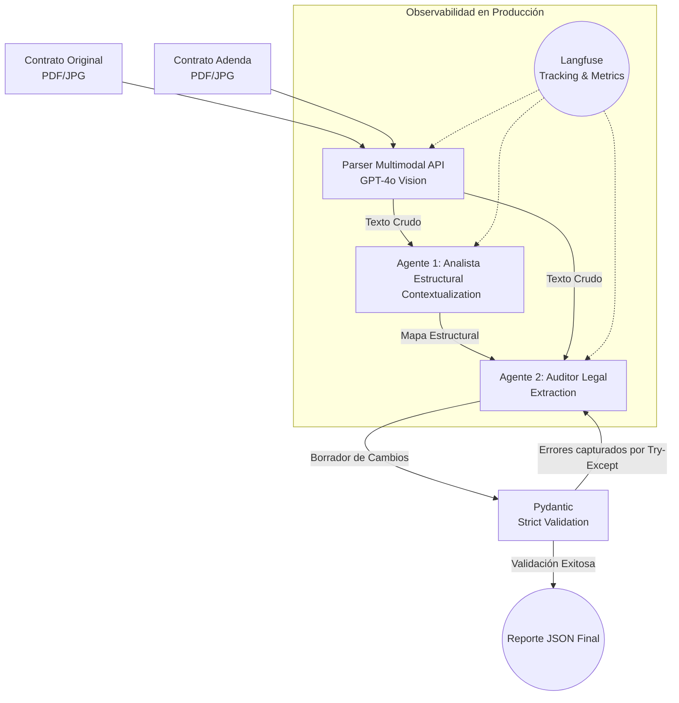
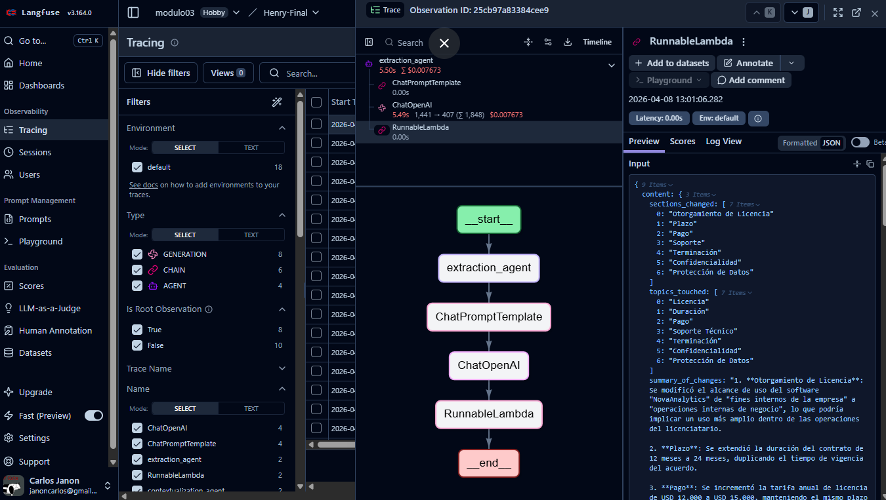
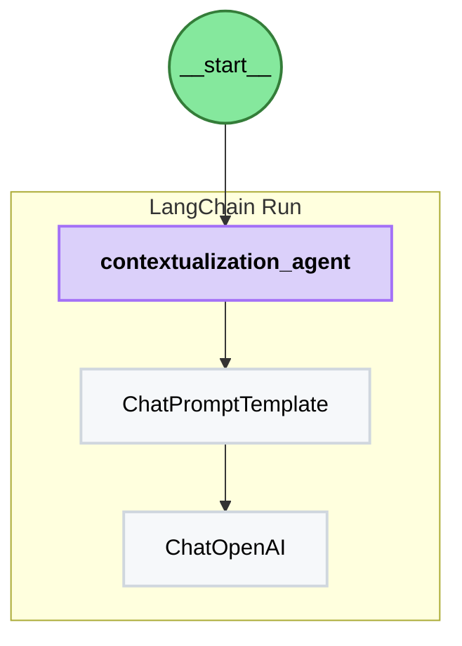

# LegalMove AI: Sistema Autónomo multi-agente de Comparación de Contratos
# PI Cohorte ai-engineering-pt01

Bienvenido al repositorio de **LegalMove AI**. Este proyecto aborda el desafío operacional de comparar manualmente los contratos originales frente a sus respectivas adendas (enmiendas).

Mediante la implementación de capacidades multimodales de **GPT-4o Vision** y un sistema inteligente multi-agente guiado por **LangChain**, este software autonomiza la tarea de analistas de cumplimiento para identificar, extraer y resumir de forma precisa los impactos legales y adiciones textuales, exportándolos un formato JSON estrictamente validado para producción y sin sesgos.

## Arquitectura y Diagrama de Flujo

El sistema sigue un modelo de separación de responsabilidades (*Separation of Concerns*) entre agentes, donde el proceso fluye desde el tratamiento de imagen hasta la estructura semántica de los documentos.



### Agente 1: Contextualization Agent
Se encarga de identificar qué partes del documento de adenda referencian secciones específicas del esquema principal (original). Elimina el riesgo de "alucinación" ordenando la lectura.

### Agente 2: Extraction Agent
Recibe dicho Mapa Estructural y extrae con exactitud legal las _adiciones, borrados y modificaciones_. Garantiza que la respuesta se restrinja y emita el esquema Pydantic para los atributos `sections_changed`, `topics_touched` y `summary_of_changes`.

### Justificación: Long-Context vs RAG
A diferencia de sistemas robustos documentales que fragmentan la información, LegalMove utiliza una Ingestión de Contexto Largo (*Long-Context*). Debido a que un contrato típico y su adenda suelen pesar una cantidad de tokens asimilable, proveer las actas completas previene el quiebre de la semántica obligatoria evitando un falso positivo ocasionado por la vectorización de bases de datos de un escenario RAG clásico, priorizando la precisión (determinística) por encima del almacenamiento.

---

## Instalación y Configuración (Setup)

Este proyecto emplea `uv`, el administrador de paquetes unificado de Rust para lidiar con el infierno de dependencias.

1. Clona el repositorio:
   ```bash
   git clone https://github.com/....
   cd carpeta proyecto
   ```
2. Recrea el entorno virtual a través del manifiesto estricto (`requirements.txt` / `pyproject.toml`):
   ```bash
   uv venv
   uv pip install -r requirements.txt
   ```
3. Crea un archivo `.env` basado en el de muestra (`cp .env.example .env`) y rellena:
   ```env
   OPENAI_API_KEY="sk-..."
   LANGFUSE_PUBLIC_KEY="pk-lf-..."
   LANGFUSE_SECRET_KEY="sk-lf-..."
   LANGFUSE_HOST="https://us.cloud.langfuse.com"
   ```

---

## Uso Rápido (Quickstart)

El orquestador en `main.py` está configurado para operar la base de imágenes PDF. En caso de usar imágenes estándar, se puede editar las rutas provistas al pipeline.

```bash
uv run python main.py
```

Al terminar de parsear las imágenes y traspasarlas de un agente al otro, el log te desplegará automáticamente la matriz validadora:

```json
{
  "sections_changed": ["CUARTA", "QUINTA"],
  "topics_touched": ["Duration", "Pricing"],
  "summary_of_changes": "Se modificó la cláusula CUARTA extendiendo..."
}
```

## Trazabilidad en Langfuse
Cada operación realizada interactúa con `langfuse`. La instancia y sesión es global configurada nativamente como `CallbackHandler()`, generando trazas secuenciales nombradas directamente con `run_name=` en el backend. Revisen su endpoint en *Cloud* para visualizar el _Span Hierarchy_ con su latencia, tokens y coste por etapa (Parsing, Análisis, Extracción).



### Topología de Ejecución (LangChain & Langfuse)
Para demostrar la instrumentación, este diagrama ejemplifica cómo se mapean los flujos internos de manera individual en el panel de Langfuse durante la corrida de los agentes (ej. el agente de contextualización):



## Pruebas Adicionales
Otro par de contratos y adendas de demostración se encuentra en `/data/test_contracts`, detallados en su propio `README.md` localizado ahí mismo.


